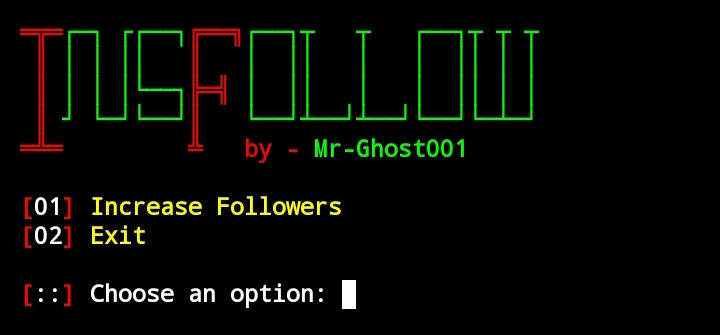

# InsFollow

  

Best Tool For Increase Instagram Follower.

## Requirements
1. openssl
2. curl

## How to Install in Termux

`$ pkg up -y`

`$ pkg install openssl-tool`

`$ pkg install curl`

`$ pkg install git`

`$ git clone https://github.com/Mr-Ghost001/Insfollow`

`$ cd Insfollow`

`$ chmod +x insfollow.sh`

`$ termux-wake-lock`

`$ bash insfollow.sh`

---

  Follow me on

  
  <a href="https://wa.me/+94783211740">
    

